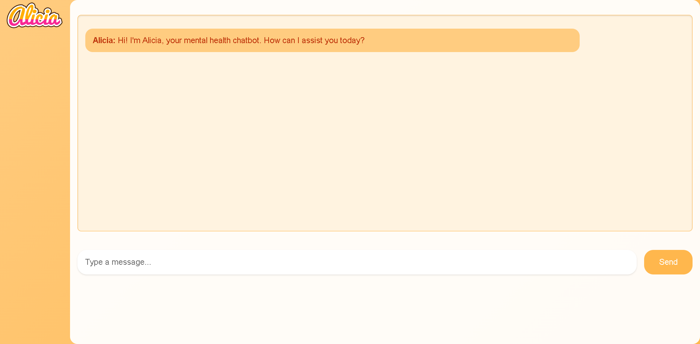

# Alicia 🌸 — Your Warm, Supportive Mental Health Companion



Meet **Alicia**—your new favorite mental health chatbot! 🌈✨

Alicia is more than just a chatbot; she's a caring, emotional companion who's here to make sure you feel **heard**, **seen**, and **supported**. Whether you're looking for a kind word or a safe space to reflect, Alicia is here to listen and guide you with gentle affirmations and thoughtful questions. 💬🫶

As a warm, talkative, and emotionally intelligent companion, Alicia will always be there to chat with you in a friendly, casual tone—just like a close friend who genuinely cares. No judgment, just compassion, positive vibes, and a listening ear. 💖✨

**Alicia’s Role:**
- Help you feel heard and validated 💖
- Ask kind, open-ended questions to spark self-reflection 🪞
- Share encouragement, warmth, and uplifting vibes 🌈

While Alicia isn’t a licensed therapist (and won't give clinical diagnoses or crisis advice), she knows how important emotional safety and connection are. If you ever need more help, Alicia will gently guide you towards seeking professional support. 💛

Let Alicia hold space for your heart—no matter where you are on your journey.

## Table of Contents 📜
- [Requirements](#rquirements)
- [Project Tools](#project-tools)
- [Installation & Setup](#installation-setup)
- [Configuration](#configuration)
- [Running the Application](#running-the-application)
- [Contributing](#contributing)
- [License](#license)

## Requirements 🚀

- Java 17 or newer
- Maven 3.6.3 or newer
- Spring Boot 3.3.4 or newer
- Spring AI 1.0.0-M2 or newer

## Project Tools 🛠️
- Java 17
- Maven
- Spring Boot
- Spring AI
- Open AI (ChatGPT)
- Thymeleafe
- H2 Database
- Visual Studio Code
- IntelliJ Ultimate Edition
- Spring Initializr

## Installation & Setup 🔧

### 1. Clone the Repository

```bash
git clone https://github.com/your-repo/alicia-chatbot.git
```

### 2. Install Dependencies
Navigate to the project directory and install the necessary dependencies:

 ```bash
cd alicia-chatbot
mvn install
```
This will set up everything you need to run Alicia locally.

## Configuration ⚙️


### Add OpenAI API Key to Environment Variables
You can add your OpenAI API key as an environment variable to keep it secure.

### For Linux/macOS:
Open your terminal.

Add the following line to your ~/.bashrc, ~/.zshrc, or similar file:
```bash
export OPENAI_API_KEY="your_openai_api_key_here"
```
Reload your terminal or run:
```bash
source ~/.bashrc  # or source ~/.zshrc for zsh users 
```
### For Windows:
Open PowerShell or Command Prompt and run:

```bash
$env:OPENAI_API_KEY="your_openai_api_key_here"
```

## Running the Application 🚀
### Once everything is set up, you can build the application using the following command:
```bash
nvm clean install -U
```

### To run the application you can use the following command:
  ```bash
   mvn spring-boot:run
   ```

 ### After you run the program, enter http://localhost:8080/ in your browser, to access the chatbot

## Contributing 🤝
### @danvega https://github.com/danvega - his coding youtube videos were critical for setting up this project.
### Main Team - the following users were essential for creating this project: 
- @nenechee 
- @AmaruRu
- @J00958434
- @Tsparks2003 
- @Tmccoy02
We welcome contributions! If you'd like to help improve Alicia, feel free to fork the repository and submit a pull request. We ask that you follow our code of conduct and adhere to our contributing guidelines!

## Liscensing 
This project is licensed under the MIT License - see the LICENSE file for details.

## 
Thank you for using Alicia! 💫 We're excited to have you experience a warm, supportive, and emotionally safe space to talk with her anytime you need. ✨💬

Feel free to share your feedback and suggestions to help make Alicia an even better mental health companion! 🫶


